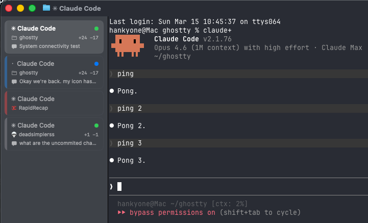

<p align="center">
<<<<<<< HEAD
  
=======
  
  <br>Ghostty
</h1>
  <p align="center">
    Fast, native, feature-rich terminal emulator pushing modern features.
    <br />
    A native GUI or embeddable library via <code>libghostty</code>.
    <br />
    <a href="#about">About</a>
    ·
    <a href="https://ghostty.org/download">Download</a>
    ·
    <a href="https://ghostty.org/docs">Documentation</a>
    ·
    <a href="CONTRIBUTING.md">Contributing</a>
    ·
    <a href="HACKING.md">Developing</a>
  </p>
>>>>>>> upstream/main
</p>

<h1 align="center">Ghostty Pro Plus Ultra</h1>

<p align="center">
A personal Ghostty fork with a sidebar tab system, Claude Code integration, and quality-of-life improvements for macOS.
</p>

<<<<<<< HEAD
<p align="center">
  
</p>

## Features

### Sidebar
=======
**`libghostty`** is a cross-platform, zero-dependency C and Zig library
for building terminal emulators or utilizing terminal functionality
(such as style parsing). Anyone can use `libghostty` to build a terminal
emulator or embed a terminal into their own applications. See
[Ghostling](https://github.com/ghostty-org/ghostling) for a minimal complete project
example or the [`examples` directory](https://github.com/ghostty-org/ghostty/tree/main/example)
for smaller examples of using `libghostty` in C and Zig.
>>>>>>> upstream/main

Replaces the native tab bar with a left sidebar showing rich tab cards:

- **Tab cards** with title, directory, and git diff stats (`+N -N`)
- **Project favicons** — auto-detected from web projects, shown instead of the folder icon
- **Hover state** — tab cards highlight on mouse hover
- **Middle-click to close** — middle-click any tab card to close it
- **Double-click empty space** — creates a new tab
- **Drag-and-drop** — reorder tabs by dragging
- **Custom status entries** — show ports, environments, or any metadata via CLI
- **Attention indicators** — orange dot on tabs with notifications or bell
- **Theme-aware** — colors derived from your terminal theme
- **Tab colors** — assign colors to tabs via context menu

### Claude Code Integration

When running Claude Code, the sidebar shows:

- **Session summary** — AI-generated description of what you're working on, updated every 3 messages
- **Instant tooltip** — hover to see the full summary
- **Activity indicator** — pulsing blue dot while Claude is working, orange pulsing dot when waiting for input, solid green dot when done

Powered by Claude Code hooks that call `ghosttyctl set-status` to push context to the sidebar.

**Setup:**

```bash
# 1. Copy the hook script
mkdir -p ~/.claude/hooks
cp cli/ghostty-sidebar-hook.sh ~/.claude/hooks/ghostty-sidebar.sh

<<<<<<< HEAD
# 2. Register hooks in Claude Code settings (merges with existing settings)
python3 -c "
import json, os
p = os.path.expanduser('~/.claude/settings.json')
s = json.load(open(p)) if os.path.exists(p) else {}
cmd = 'bash ~/.claude/hooks/ghostty-sidebar.sh'
entry = [{'hooks': [{'type': 'command', 'command': cmd}]}]
s['hooks'] = {e: entry for e in ['SessionStart','UserPromptSubmit','PreToolUse','Notification','Stop','SessionEnd']}
json.dump(s, open(p, 'w'), indent=2)
print('Hooks installed.')
"
=======
Ghostty is stable and in use by millions of people and machines daily.

The high-level ambitious plan for the project, in order:

|  #  | Step                                                    | Status |
| :-: | ------------------------------------------------------- | :----: |
|  1  | Standards-compliant terminal emulation                  |   ✅   |
|  2  | Competitive performance                                 |   ✅   |
|  3  | Rich windowing features -- multi-window, tabbing, panes |   ✅   |
|  4  | Native Platform Experiences                             |   ✅   |
|  5  | Cross-platform `libghostty` for Embeddable Terminals    |   ✅   |
|  6  | Ghostty-only Terminal Control Sequences                 |   ❌   |

Additional details for each step in the big roadmap below:

#### Standards-Compliant Terminal Emulation

Ghostty implements all of the regularly used control sequences and
can run every mainstream terminal program without issue. For legacy sequences,
we've done a [comprehensive xterm audit](https://github.com/ghostty-org/ghostty/issues/632)
comparing Ghostty's behavior to xterm and building a set of conformance
test cases.

In addition to legacy sequences (what you'd call real "terminal" emulation),
Ghostty also supports more modern sequences than almost any other terminal
emulator. These features include things like the Kitty graphics protocol,
Kitty image protocol, clipboard sequences, synchronized rendering,
light/dark mode notifications, and many, many more.

We believe Ghostty is one of the most compliant and feature-rich terminal
emulators available.

Terminal behavior is partially a de jure standard
(i.e. [ECMA-48](https://ecma-international.org/publications-and-standards/standards/ecma-48/))
but mostly a de facto standard as defined by popular terminal emulators
worldwide. Ghostty takes the approach that our behavior is defined by
(1) standards, if available, (2) xterm, if the feature exists, (3)
other popular terminals, in that order. This defines what the Ghostty project
views as a "standard."

#### Competitive Performance

Ghostty is generally in the same performance category as the other highest
performing terminal emulators.

"The same performance category" means that Ghostty is much faster than
traditional or "slow" terminals and is within an unnoticeable margin of the
well-known "fast" terminals. For example, Ghostty and Alacritty are usually within
a few percentage points of each other on various benchmarks, but are both
something like 100x faster than Terminal.app and iTerm. However, Ghostty
is much more feature rich than Alacritty and has a much more native app
experience.

This performance is achieved through high-level architectural decisions and
low-level optimizations. At a high-level, Ghostty has a multi-threaded
architecture with a dedicated read thread, write thread, and render thread
per terminal. Our renderer uses OpenGL on Linux and Metal on macOS.
Our read thread has a heavily optimized terminal parser that leverages
CPU-specific SIMD instructions. Etc.

#### Rich Windowing Features

The Mac and Linux (build with GTK) apps support multi-window, tabbing, and
splits with additional features such as tab renaming, coloring, etc. These
features allow for a higher degree of organization and customization than
single-window terminals.

#### Native Platform Experiences

Ghostty is a cross-platform terminal emulator but we don't aim for a
least-common-denominator experience. There is a large, shared core written
in Zig but we do a lot of platform-native things:

- The macOS app is a true SwiftUI-based application with all the things you
  would expect such as real windowing, menu bars, a settings GUI, etc.
- macOS uses a true Metal renderer with CoreText for font discovery.
- macOS supports AppleScript, Apple Shortcuts (AppIntents), etc.
- The Linux app is built with GTK.
- The Linux app integrates deeply with systemd if available for things
  like always-on, new windows in a single instance, cgroup isolation, etc.

Our goal with Ghostty is for users of whatever platform they run Ghostty
on to think that Ghostty was built for their platform first and maybe even
exclusively. We want Ghostty to feel like a native app on every platform,
for the best definition of "native" on each platform.

#### Cross-platform `libghostty` for Embeddable Terminals

In addition to being a standalone terminal emulator, Ghostty is a
C-compatible library for embedding a fast, feature-rich terminal emulator
in any 3rd party project. This library is called `libghostty`.

Due to the scope of this project, we're breaking libghostty down into
separate actually libraries, starting with `libghostty-vt`. The goal of
this project is to focus on parsing terminal sequences and maintaining
terminal state. This is covered in more detail in this
[blog post](https://mitchellh.com/writing/libghostty-is-coming).

`libghostty-vt` is already available and usable today for Zig and C and
is compatible for macOS, Linux, Windows, and WebAssembly. The functionality
is extremely stable (since its been proven in Ghostty GUI for a long time),
but the API signatures are still in flux.

`libghostty` is already heavily in use. See [`examples`](https://github.com/ghostty-org/ghostty/tree/main/example)
for small examples of using `libghostty` in C and Zig or the
[Ghostling](https://github.com/ghostty-org/ghostling) project for a
complete example. See [awesome-libghostty](https://github.com/Uzaaft/awesome-libghostty)
for a list of projects and resources related to `libghostty`.

We haven't tagged libghostty with a version yet and we're still working
on a better docs experience, but our [Doxygen website](https://libghostty.tip.ghostty.org/)
is a good resource for the C API.

#### Ghostty-only Terminal Control Sequences

We want and believe that terminal applications can and should be able
to do so much more. We've worked hard to support a wide variety of modern
sequences created by other terminal emulators towards this end, but we also
want to fill the gaps by creating our own sequences.

We've been hesitant to do this up until now because we don't want to create
more fragmentation in the terminal ecosystem by creating sequences that only
work in Ghostty. But, we do want to balance that with the desire to push the
terminal forward with stagnant standards and the slow pace of change in the
terminal ecosystem.

We haven't done any of this yet.

## Crash Reports

Ghostty has a built-in crash reporter that will generate and save crash
reports to disk. The crash reports are saved to the `$XDG_STATE_HOME/ghostty/crash`
directory. If `$XDG_STATE_HOME` is not set, the default is `~/.local/state`.
**Crash reports are _not_ automatically sent anywhere off your machine.**

Crash reports are only generated the next time Ghostty is started after a
crash. If Ghostty crashes and you want to generate a crash report, you must
restart Ghostty at least once. You should see a message in the log that a
crash report was generated.

> [!NOTE]
>
> Use the `ghostty +crash-report` CLI command to get a list of available crash
> reports. A future version of Ghostty will make the contents of the crash
> reports more easily viewable through the CLI and GUI.

Crash reports end in the `.ghosttycrash` extension. The crash reports are in
[Sentry envelope format](https://develop.sentry.dev/sdk/envelopes/). You can
upload these to your own Sentry account to view their contents, but the format
is also publicly documented so any other available tools can also be used.
The `ghostty +crash-report` CLI command can be used to list any crash reports.
A future version of Ghostty will show you the contents of the crash report
directly in the terminal.

To send the crash report to the Ghostty project, you can use the following
CLI command using the [Sentry CLI](https://docs.sentry.io/cli/installation/):

```shell-session
SENTRY_DSN=https://e914ee84fd895c4fe324afa3e53dac76@o4507352570920960.ingest.us.sentry.io/4507850923638784 sentry-cli send-envelope --raw <path to ghostty crash>
>>>>>>> upstream/main
```

Requires `jq` and the `claude` CLI in your PATH.

### CLI

Install: symlink `cli/ghosttyctl` to somewhere on your PATH (e.g. `~/.local/bin/ghosttyctl`).

```bash
ghosttyctl rename "My Tab"                                    # rename tab
ghosttyctl notify --title "Done" --body "Build finished"      # send notification
ghosttyctl set-status server "localhost:3000" --icon network  # add status entry
ghosttyctl clear-status server                                # remove it
ghosttyctl list                                               # list all tabs
ghosttyctl current                                            # current tab info
```

### Config

```
# Choose which fields to show (default: all)
sidebar-fields = title,directory,git-branch,status
```

### Auto-Update

Built-in Sparkle auto-updates. The app checks for new versions automatically and prompts to install.

## Building

```bash
zig build       # debug build
zig build run   # build and launch
```

See [HACKING.md](HACKING.md) for full build instructions.

## Attribution

This project is built on top of:

- [Ghostty](https://github.com/ghostty-org/ghostty) by Mitchell Hashimoto — the original terminal emulator ([ghostty.org](https://ghostty.org))
- [pacaya/ghostty](https://github.com/pacaya/ghostty) (aka [tomreinert/ghostty](https://github.com/tomreinert/ghostty)) — added the sidebar tab system

Not affiliated with the upstream Ghostty project.
