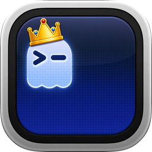
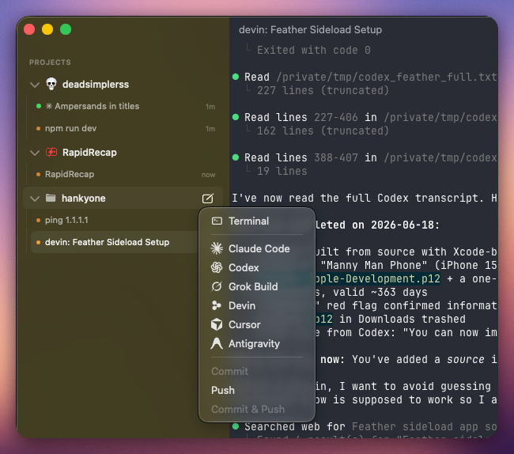

<p align="center">
  
</p>

<h1 align="center">Ghostty Pro Plus Ultra</h1>

<p align="center">
A personal Ghostty fork with a project-grouped sidebar, AI agent integration, and quality-of-life improvements for macOS.
</p>

<p align="center">
  
</p>

## Features

### Project-Grouped Sidebar

A T3 Code-inspired sidebar that replaces the native tab bar. Terminals are automatically grouped by project — detected from `.git`, `package.json`, `Cargo.toml`, and other markers. Each project section shows auto-detected favicons (from Xcode, Android, or web projects), git diff stats, and a collapsible tab list. Ungrouped terminals live in an "Other" section at the bottom.

### AI Agent Integration

Built-in support for Claude Code and Codex. The sidebar shows live status for each agent session — pulsing blue while working, orange when waiting for input, green when done. Each project header has a button to launch a new session or resume a recent one directly from the sidebar.

### Tab Restore

Browser-like session persistence — quit and reopen, and everything comes back. Working directories, tab titles, colors, sidebar metadata, and agent resume commands are all preserved across restarts.

### Hook Setup

The sidebar integration is powered by hooks that push status updates via `ghosttyctl`. Requires `jq` in your PATH.

**Claude Code:**

```bash
# 1. Copy the hook script
mkdir -p ~/.claude/hooks
cp cli/ghostty-sidebar-hook.sh ~/.claude/hooks/ghostty-sidebar.sh

# 2. Register hooks in Claude Code settings (merges with existing settings)
python3 -c "
import json, os
p = os.path.expanduser('~/.claude/settings.json')
s = json.load(open(p)) if os.path.exists(p) else {}
cmd = 'bash ~/.claude/hooks/ghostty-sidebar.sh'
entry = [{'hooks': [{'type': 'command', 'command': cmd}]}]
s['hooks'] = {e: entry for e in ['SessionStart','UserPromptSubmit','PreToolUse','Notification','Stop','StopFailure','SessionEnd']}
json.dump(s, open(p, 'w'), indent=2)
print('Hooks installed.')
"
```

**Codex:**

```bash
# Register hooks in Codex settings (merges with existing settings)
python3 -c "
import json, os
p = os.path.expanduser('~/.codex/hooks.json')
s = json.load(open(p)) if os.path.exists(p) else {}
cmd = 'bash $(pwd)/cli/ghostty-codex-hook.sh'
entry = [{'hooks': [{'type': 'command', 'command': cmd}]}]
s['hooks'] = {e: entry for e in ['SessionStart','UserPromptSubmit','PreToolUse','PostToolUse','Stop']}
json.dump(s, open(p, 'w'), indent=2)
print('Hooks installed.')
"
```

### CLI

Install: symlink `cli/ghosttyctl` to somewhere on your PATH (e.g. `~/.local/bin/ghosttyctl`).

```bash
ghosttyctl rename "My Tab"                                    # rename tab
ghosttyctl notify --title "Done" --body "Build finished"      # send notification
ghosttyctl set-status server "localhost:3000" --icon network  # add status entry
ghosttyctl clear-status server                                # remove it
ghosttyctl list                                               # list all tabs
ghosttyctl current                                            # current tab info
```

### Config

```
# Choose which fields to show (default: all)
sidebar-fields = title,directory,git-branch,status
```

### Auto-Update

Built-in Sparkle auto-updates. The app checks for new versions automatically and prompts to install.

## Building

```bash
zig build       # debug build
zig build run   # build and launch
```

See [HACKING.md](HACKING.md) for full build instructions.

## Attribution

This project is built on top of:

- [Ghostty](https://github.com/ghostty-org/ghostty) by Mitchell Hashimoto — the original terminal emulator ([ghostty.org](https://ghostty.org))
- [pacaya/ghostty](https://github.com/pacaya/ghostty) (aka [tomreinert/ghostty](https://github.com/tomreinert/ghostty)) — added the sidebar tab system

Not affiliated with the upstream Ghostty project.
